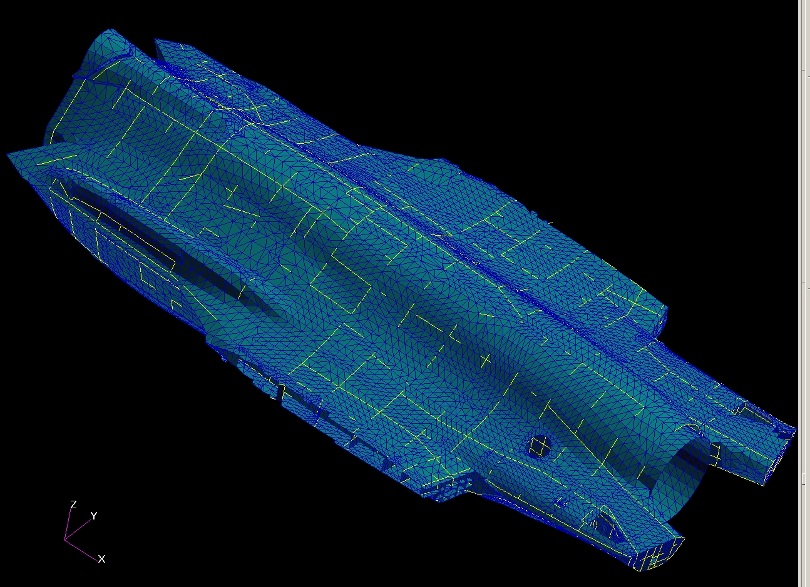

# ========================================
# AV Reduced System Thermal Model From NASTRAN Loads Model using CSGMIN Tool:
# ========================================

##
## I. Air Vehicle Reduced System Thermal Model Shell (minus discrete interior items). Derived from the Structural Loads Model, and subsequently converted to a thermal equivalent model. Composites were converted to equivalent PSHELL elements using supplied ply/core lay-up data:

### I.a. Number of Diffusion Nodes: 11,695
### I.b. Number of Arithmetic Nodes: 13,027
### I.c. Total Number of Nodes: 24,722
### I.d. Total Number of Conductors: 77,625
### I.e. CSGMIN Criteria for Conversion of Diffusion Node to Arithmetic Node: 1.0E-1
### I.f. Does include Engine outside diameter surface
### I.g. Length Units: FEET
### I.h. Energy Units: BTU
### I.i. Time Units: HOURS
###

##
## II. Utility Input File: Geometry File: (AV_reduced_model.bdf) NASTRAN Reduced Thermal BDF file, may be used to import into PATRAN or FEMAP to view geometry, node id's, etc.
    =================================
    START: "AV_reduced_model.bdf"
    =================================
    ... CONTENT REMOVED ...
    $ Direct Text Input for Global Case Control Data
    SUBCASE 1
    $ Subcase name : Default
       SUBTITLE=Default
       NLPARM = 1
       THERMAL(PLOT,SORT1,PRINT)=ALL
       FLUX(PLOT,SORT1,PRINT)=ALL
    BEGIN BULK
    PARAM    POST    -1
    PARAM    AUTOSPC YES
    PARAM    TABS    460.
    PARAM    SIGMA   1.73-9
    NLPARM   1       0               AUTO    5       25      PW      NO
                     .001    1.-7
    $ Direct Text Input for Bulk Data
    $ Elements and Element Properties for region : pbar.1
    PBAR     1       627     3.5-4
    $ Pset: "pbar.1" will be imported as: "pbar.1"
    CBAR     28594   1       345     39      0.      .08333  0.
    CBAR     28634   1       347     41      0.      .08333  0.
    CBAR     28642   1       200     399     0.      .08333  0.
    CBAR     28681   1       202     401     0.      .08333  0.
    CBAR*    35574           1               11602           11603
    *        0.              .00833          0.
    CBAR*    35575           1               11603           11604
    *        0.              .00833          0.
    ... CONTENT REMOVED ...
    GRID     26624           35.375  0.      9.818
    GRID     26625           35.375  .395    9.779
    GRID     26626           35.375  .776    9.664
    GRID     26627           35.375  1.126   9.477
    GRID     26628           35.375  1.433   9.225
    GRID     26629           35.375  1.685   8.918
    GRID     26630           35.375  1.872   8.567
    GRID     26631           35.375  1.988   8.187
    $ Loads for Load Case : Default
    $ Default Initial Temperature
    TEMPD    1       0.
    $ Referenced Coordinate Frames
    ENDDATA 1d748902
    =================================
    END: "AV_reduced_model.bdf"
    =================================

##
## III. Utility Output Files:
### III.a. SINDA/G Model File: (reduced_system_model.sin) SINDA/G translation of NASTRAN Thermal BDF file, thermal node and conductor definitions:
    =================================
    START: "./output/reduced_system_model.sin"
    =================================
    C SINDA/G input file created for problem name: reduced_system_model_e1
           BCD 3THERMAL LPCS
           BCD 9Sinda/G model  from Patran/Nastran
           BCD 9  Model name = reduced_system_model_e1
           END
           BCD 3NODE DATAC START NODES DUE TO ELEMENT CONDUCTION
    C
    C               1,      70.0     ,  0.1286002E-01
                    1,      70.0     ,  -1.0
                    2,      70.0     ,  0.9658077E-01
                    3,      70.0     ,  0.7934276E-01
    C
    C               4,      70.0     ,  0.4710976E-01
                    4,      70.0     ,  -1.0
                    5,      70.0     ,  0.7991743E-01
                    6,      70.0     ,  0.7829599E-01
    C
    C               7,      70.0     ,  0.4381916E-01
                    7,      70.0     ,  -1.0
                    8,      70.0     ,  0.1037006E+00
                    9,      70.0     ,  0.1007659E+00
    C
    ... CONTENT REMOVED ...
                77940,   26625,   26626,  0.3179480E+00
                77941,   26626,   26627,  0.3188724E+00
                77942,   26627,   26628,  0.3185852E+00
                77943,   26628,   26629,  0.3185852E+00
                77944,   26629,   26630,  0.3181650E+00
                77945,   26630,   26631,  0.3184813E+00
    C END CONDUCTORS DUE TO ELEMENT CONDUCTION
           END
           BCD 3CONSTANTS DATA
               DRLXCA=0.1000000E-02
               ARLXCA=0.1000000E-02
               NLOOP=5000
               SIGMA=0.1730000E-08
               TMPZRO=460.0000
           END
           BCD 3ARRAY DATA
           END
           BCD 3EXECUTION
               SNSOR 
           END
           BCD 3VARIABLES 1
           END
           BCD 3VARIABLES 2
           END
           BCD 3OUTPUT CALLS
               TPNTSN      
               PATOUT      
           END
           BCD 3END OF DATA
    =================================
    END: "./output/reduced_system_model.sin"
    =================================

### III.b. SINDA/G Convective Resistor File: (convec_resis.sin) SINDA/G convective resistors including areas associated with 2D element & bar elements:
    =================================
    START: "./output/convec_resis.sin"
    =================================
    ... CONTENT REMOVED ...
    C
    C     Node ID:        1     Quad/Tri Area (sq. ft.):   0.04692672     Cbar Area (sq. ft.):   0.00000000
           1000001,       1, 1000001,  1.00000000 *   0.02346336
           1000002,       1, 2000001,  1.00000000 *   0.02346336
           1000003,       1, 1000001,  1.00000000 *   0.00000000
           1000004,       1, 2000001,  1.00000000 *   0.00000000
    C
    C     Node ID:        2     Quad/Tri Area (sq. ft.):   0.06553803     Cbar Area (sq. ft.):   0.00000000
           1000005,       2, 1000002,  1.00000000 *   0.03276901
           1000006,       2, 2000002,  1.00000000 *   0.03276901
           1000007,       2, 1000002,  1.00000000 *   0.00000000
           1000008,       2, 2000002,  1.00000000 *   0.00000000
    C
    C     Node ID:        3     Quad/Tri Area (sq. ft.):   0.01465198     Cbar Area (sq. ft.):   0.00000000
           1000009,       3, 1000003,  1.00000000 *   0.00732599
           1000010,       3, 2000003,  1.00000000 *   0.00732599
           1000011,       3, 1000003,  1.00000000 *   0.00000000
           1000012,       3, 2000003,  1.00000000 *   0.00000000
    C
    C     Node ID:        4     Quad/Tri Area (sq. ft.):   0.11187263     Cbar Area (sq. ft.):   0.03216128
           1000013,       4, 1000004,  1.00000000 *   0.05593631
           1000014,       4, 2000004,  1.00000000 *   0.05593631
           1000015,       4, 1000004,  1.00000000 *   0.01608064
           1000016,       4, 2000004,  1.00000000 *   0.01608064
    C
    ... CONTENT REMOVED ...
    C
          -1026627,   68.000    , 1.0      $ Boundary Node A for Node ID:    26627
          -2026627,   68.000    , 1.0      $ Boundary Node B for Node ID:    26627
    C
          -1026628,   68.000    , 1.0      $ Boundary Node A for Node ID:    26628
          -2026628,   68.000    , 1.0      $ Boundary Node B for Node ID:    26628
    C
          -1026629,   68.000    , 1.0      $ Boundary Node A for Node ID:    26629
          -2026629,   68.000    , 1.0      $ Boundary Node B for Node ID:    26629
    C
          -1026630,   68.000    , 1.0      $ Boundary Node A for Node ID:    26630
          -2026630,   68.000    , 1.0      $ Boundary Node B for Node ID:    26630
    C
          -1026631,   68.000    , 1.0      $ Boundary Node A for Node ID:    26631
          -2026631,   68.000    , 1.0      $ Boundary Node B for Node ID:    26631
    C
    =================================
    END: "./output/convec_resis.sin"
    =================================
